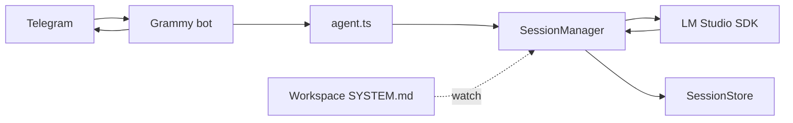

# deno-ai-agent

A [Deno](https://deno.com/) Telegram bot backed by a local [LM Studio](https://lmstudio.ai/) model. Messages are handled in a persistent chat context with a hot-reloadable system prompt, optional tools, and [OpenTelemetry](https://opentelemetry.io/) instrumentation.

## Prerequisites

- [Deno](https://docs.deno.com/runtime/getting_started/installation/) 2.x
- [LM Studio](https://lmstudio.ai/) running locally with a loaded model
- A Telegram bot token ([@BotFather](https://t.me/BotFather))

## Quick start

1. Clone the repo and create `.env` in the project root:

```env
TELEGRAM_BOT_TOKEN=
TELEGRAM_ADMIN_ID=
TELEGRAM_BOT_ID=

MODEL=your-lmstudio-model-id
CONTEXT_LENGTH=65536

BOT_NAME=Silas
WORKSPACE_PATH=.silas
```

2. Add a system prompt at `{WORKSPACE_PATH}/SYSTEM.md` (for example `.silas/SYSTEM.md`).

3. Start LM Studio and load the model named in `MODEL`.

4. Run the bot:

```sh
deno task start
```

Only the Telegram user matching `TELEGRAM_ADMIN_ID` can chat with the bot (others get a short refusal).

## Environment variables

| Variable | Description |
| -------- | ----------- |
| `TELEGRAM_BOT_TOKEN` | Bot token from BotFather |
| `TELEGRAM_ADMIN_ID` | Numeric Telegram user ID allowed to use the bot |
| `TELEGRAM_BOT_ID` | Bot username or label (informational) |
| `MODEL` | LM Studio model identifier |
| `CONTEXT_LENGTH` | Max context tokens passed to the model |
| `BOT_NAME` | Agent display name |
| `WORKSPACE_PATH` | Directory under the repo root containing `SYSTEM.md` |
| `OTEL_DENO` | Set to `true` to enable Deno’s built-in OTLP export |
| `OTEL_SERVICE_NAME` | Service name in telemetry backends (default: `deno-ai-agent`) |
| `OTEL_EXPORTER_OTLP_ENDPOINT` | OTLP HTTP endpoint (default: `http://localhost:4318`) |
| `OTEL_EXPORTER_OTLP_PROTOCOL` | `http/protobuf` (default), `console`, or `grpc` |
| `LOG_LEVEL` | Set to `debug` for token/context stats (no message bodies) |

Copy `.env.example` to `.env` and fill in values.

## How it works



1. An incoming Telegram message is appended to the current session.
2. `model.act()` runs against LM Studio with the current history and tools.
3. Assistant text is streamed into context and sent back as a MarkdownV2 reply (`stripThinking` removes model “thinking” blocks).
4. Changes to `SYSTEM.md` in the workspace reload the system prompt without restarting.
5. When context exceeds ~75% of `CONTEXT_LENGTH`, older turns are summarized via LM Studio and replaced with a compact summary.

### Model tools (workspace sandbox)

Silas registers seven tools for LM Studio: `read`, `write`, `edit`, `bash`, `grep`, `find`, and `ls`. All file and shell access is confined to `WORKSPACE_PATH` (for example `.silas/`). The model cannot read or modify the application source tree outside that directory.

| Tool | Purpose |
| ---- | ------- |
| `read` | Read text files (`offset` / `limit` for large files) |
| `write` | Create or overwrite files |
| `edit` | Exact text replacements (`edits[]`) |
| `bash` | Shell commands with cwd set to the workspace (`--allow-run` required) |
| `grep` | Search contents (`rg` when installed; built-in fallback otherwise) |
| `find` | Find files by glob (`fd` when installed; built-in fallback otherwise) |
| `ls` | List directory entries |

Optional: install [ripgrep](https://github.com/BurntSushi/ripgrep) and [fd](https://github.com/sharkdp/fd) for faster search. The built-in grep fallback does not fully honor `.gitignore`.

Future: a `TOOL_ROOT` env var could widen the sandbox to the repo root for coding tasks (not implemented in v1).

### Session commands (admin)

| Command | Action |
| ------- | ------ |
| `/new` | Fresh in-memory session (new id; does not save the previous one) |
| `/save` | Write current chat to `{WORKSPACE_PATH}/sessions/{id}.json` |
| `/load <id>` | Restore a saved session (`/resume` is an alias) |
| `/fork` | Save current session, then branch into a new id with the same history |
| `/list` | List saved session ids |
| `/session` | Current id, save state, message and token counts |
| `/stats` | Same as `/session` but refreshes token count first |
| `/help` | Session command summary |

Custom OpenTelemetry spans: `telegram.message` (root span per turn), `lmstudio.act`, and `context.compact`. Deno also auto-instruments `fetch` and `console.*` when `OTEL_DENO=true`. The collector redacts Telegram bot tokens in `url.full` before export.

Replies use MarkdownV2 when possible; invalid formatting falls back to plain text. Errors during handling send a short message to the admin chat.

## Observability

Telemetry is optional. See [otel/README.md](./otel/README.md) for full detail.

### Trace UI with Jaeger (no Docker)

Install the Jaeger binary once, then run three processes in separate terminals:

```sh
deno task otel:jaeger:install   # once
deno task otel:jaeger           # UI → http://localhost:16686
deno task otel:collector:jaeger # OTLP receiver on :4318
deno task start:otel            # bot with OTEL_DENO=true
```

After messaging the bot, open Jaeger → **Search** → service **`deno-ai-agent`**.

### Other modes

| Task | Use when |
| ---- | -------- |
| `deno task start:otel:console` | Print spans/metrics/logs to stderr; no collector |
| `deno task otel:collector:jaeger` + `deno task start:otel` | Forward traces to Jaeger and print collector debug logs |

Install the OpenTelemetry Collector **contrib** binary once (not the minimal `otelcol` core build):

```sh
deno task otel:collector:install
```

`http://localhost:4318` is an OTLP ingestion API, not a web page — a browser 404 there is expected.

## Development

```sh
deno task check:fmt
deno task check:lint
deno task check:types
deno task test
deno task ci          # all checks + tests
```

## Project layout

```
main.ts              Entry point: wires agent, workspace, Telegram
src/
  agent.ts           Turn runner and app wiring
  context/
    session.ts       Chat state, model turns, tokens, compaction, session API
    session-store.ts Session JSON on disk
    compactor.ts     Summarize-and-trim context compaction
  lmstudio.ts        LM Studio client and model handle
  telegram/
    telegram.ts      Grammy bot and admin gate
    commands.ts      Session command behavior and formatting
    model-reply.ts   MarkdownV2 model reply helper
    telegram-reply.ts Grammy reply adapter and error reply
  workspace.ts       SYSTEM.md load and file watch
  otel.ts            Custom spans and metrics
  log.ts             Debug logging (`LOG_LEVEL=debug`)
  tools.ts           Re-exports getModelTools from tools/
  tools/             read, write, edit, bash, grep, find, ls (pi-aligned)
  markdown.ts        Reply formatting (thinking strip, etc.)
otel/
  otel-collector.jaeger.yaml
  download-jaeger.sh
  download-otelcol.sh
  README.md
```

## License

MIT
