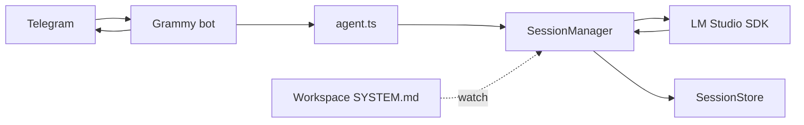

# deno-ai-agent

A [Deno](https://deno.com/) Telegram bot backed by a local [LM Studio](https://lmstudio.ai/) model. Messages are handled in a persistent chat context with a hot-reloadable system prompt, optional tools, and [OpenTelemetry](https://opentelemetry.io/) instrumentation.

## Prerequisites

- [Deno](https://docs.deno.com/runtime/getting_started/installation/) 2.x
- [LM Studio](https://lmstudio.ai/) running locally with a loaded model
- A Telegram bot token ([@BotFather](https://t.me/BotFather))

## Quick start

1. Clone the repo and create `.env` in the project root:

```env
TELEGRAM_BOT_TOKEN=
TELEGRAM_ADMIN_ID=
TELEGRAM_BOT_ID=

MODEL=your-lmstudio-model-id
CONTEXT_LENGTH=65536

BOT_NAME=Silas
WORKSPACE_PATH=.silas
```

1. Add a system prompt at `{WORKSPACE_PATH}/SYSTEM.md` (for example `.silas/SYSTEM.md`).
2. Start LM Studio and load the model named in `MODEL`.
3. Run the bot:

```sh
deno task start
```

Only the Telegram user matching `TELEGRAM_ADMIN_ID` can chat with the bot (others get a short refusal).

## Environment variables


| Variable                        | Description                                                                            |
| ------------------------------- | -------------------------------------------------------------------------------------- |
| `TELEGRAM_BOT_TOKEN`            | Bot token from BotFather                                                               |
| `TELEGRAM_ADMIN_ID`             | Numeric Telegram user ID allowed to use the bot                                        |
| `TELEGRAM_BOT_ID`               | Bot username or label (informational)                                                  |
| `MODEL`                         | LM Studio model identifier                                                             |
| `CONTEXT_LENGTH`                | Max context tokens passed to the model                                                 |
| `BOT_NAME`                      | Agent display name                                                                     |
| `WORKSPACE_PATH`                | Directory under the repo root containing `SYSTEM.md`                                   |
| `OTEL_DENO`                     | Set to `true` to enable Deno’s built-in OTLP export                                    |
| `OTEL_SERVICE_NAME`             | Service name in telemetry backends (default: `deno-ai-agent`)                          |
| `OTEL_EXPORTER_OTLP_ENDPOINT`   | OTLP HTTP endpoint (default: `http://localhost:4318`)                                  |
| `OTEL_EXPORTER_OTLP_PROTOCOL`   | `http/protobuf` (default), `console`, or `grpc`                                        |
| `LOG_LEVEL`                     | Set to `debug` for token/context stats (no message bodies)                             |
| `SILAS_BROKER_LISTEN_PATH`      | Unix socket the broker daemon listens on (`deno task start:all`)                       |
| `DENO_PERMISSION_BROKER_PATH`   | Same path for Silas; Deno connects as broker client (do not set on the daemon process) |
| `SILAS_PERMISSION_CONTROL_PATH` | Unix socket between broker daemon and main for Telegram prompts                        |
| `SILAS_PERMISSION_RUN_PROMPTS`  | Set to `1` to prompt in Telegram for each distinct `run` permission (shell)            |
| `PERMISSION_PROMPT_TIMEOUT_MS`  | Auto-deny broker prompts after this many ms (default: `120000`)                        |
| `SILAS_PROJECT_ROOT`            | Repo root for broker policy (auto-allow read under project; deny writes to `src/`)   |


Copy `.env.example` to `.env` and fill in values.

### Permission broker (optional)

For centralized Deno runtime permissions with Telegram approve/deny, copy the broker variables from `.env.example` into `.env`, then use either layout below.

**Two terminals (recommended for debugging)** — broker and agent must share the same socket paths from `.env`:

```sh
# Terminal 1
deno task broker:only

# Terminal 2 (after you see "Silas permission broker listening")
deno task agent:broker:otel
```

Do **not** run `start:all` / `start:all:otel` in terminal 2; those scripts delete the sockets and spawn another broker.

**One terminal:**

```sh
deno task start:all
```

With OpenTelemetry:

```sh
deno task start:all:otel
```

This starts a sidecar broker (`deno task broker`) then Silas with `DENO_PERMISSION_BROKER_PATH` and `-A`. CLI `--allow-*` flags are ignored while the broker is active; the daemon applies workspace-aware auto-policy and sends ambiguous requests (and every distinct `run`) to the admin chat. Silas waits for the control client to register before loading so startup is not blocked by `prompt`→deny races.

- **Allow once / Allow session / Deny** inline buttons handle runtime prompts (`pm:` callbacks).
- Deno `read`/`write` outside the workspace (including under `$HOME`, e.g. `~/.codex/`) are **prompted**; `/etc`, `/.ssh`, and repo `src/` stay auto-denied.
- Tool-layer writes and most tools stay under `WORKSPACE_PATH`; `read` also accepts absolute / `~/` host paths (tool + broker approval). Approving `run` grants **host-level** shell via `bash`.
- Tune policy with `DENO_AUDIT_PERMISSIONS` before relying on production prompts.
- Integration tests: `deno task test:broker`

## How it works




1. An incoming Telegram message is appended to the current session.
2. `model.act()` runs against LM Studio with the current history and tools.
3. Assistant text is streamed into context and sent back as a MarkdownV2 reply (`stripThinking` removes model “thinking” blocks).
4. Changes to `SYSTEM.md` in the workspace reload the system prompt without restarting.
5. When context exceeds ~75% of `CONTEXT_LENGTH`, older turns are summarized via LM Studio and replaced with a compact summary.

### Model tools

Silas exposes twelve tools: eight filesystem/shell tools (pi-aligned) — `read`, `write`, `edit`, `bash`, `deno_repl`, `grep`, `find`, `ls` — plus `skill` for activating AgentSkills under `{WORKSPACE_PATH}/skills/<name>/SKILL.md`, `todo_write` for session-scoped task tracking (shown in Telegram as an edited status message), `ask_user_question` for structured clarification via Telegram inline keyboards ([grammy-questions](https://github.com/z44d/grammy-questions)), and `agent` for spawning asynchronous read-only subagent jobs. Users can pick question options, type a custom answer (**Other**), or **Cancel**.

The `skill` tool lists available workspace skills in its description, returns the selected skill body wrapped as protected context, and lists files under that skill's `scripts/`, `references/`, and `assets/` directories without reading them eagerly. `allowed-tools` is metadata only; it does not pre-approve shell or file actions. Bundled TypeScript scripts should be run explicitly by the agent with `deno run --allow-`* permissions and `jsr:`/`npm:` imports.

Most file tools are scoped to `WORKSPACE_PATH` (e.g. `.silas/`); `read` can also open host paths via absolute or `~/` paths with approval. The bot cannot modify application source under `src/` via tools. `bash` and `deno_repl` require `--allow-run` (included in `deno task start`). Optional `rg` and `fd` on PATH speed up search; built-in fallbacks work without them.

The `agent` tool tracks subagents per current session with in-memory Deno KV. Subagents can only use `read`, `grep`, `find`, `ls`, and `skill`; they cannot mutate files, run shell commands, ask the user, manage todos, or spawn nested agents. Jobs survive only for the current bot process.

### Session commands (admin)


| Command      | Action                                                                |
| ------------ | --------------------------------------------------------------------- |
| `/new`       | Fresh in-memory session (new id; does not save the previous one)      |
| `/save`      | Write current chat to `{WORKSPACE_PATH}/sessions/{id}.json`           |
| `/load <id>` | Restore a saved session (`/resume` is an alias)                       |
| `/fork`      | Save current session, then branch into a new id with the same history |
| `/list`      | List saved session ids                                                |
| `/session`   | Current id, save state, message and token counts                      |
| `/stats`     | Same as `/session` but refreshes token count first                    |
| `/todos`     | Show or refresh the current session task list in Telegram             |
| `/help`      | Session command summary                                               |


Custom OpenTelemetry spans: `telegram.message` (root span per turn), `lmstudio.act`, and `context.compact`. Deno also auto-instruments `fetch` and `console.*` when `OTEL_DENO=true`. The collector redacts Telegram bot tokens in `url.full` before export.

Replies use MarkdownV2 when possible; invalid formatting falls back to plain text. Errors during handling send a short message to the admin chat.

## Observability

Telemetry is optional. See [otel/README.md](./otel/README.md) for full detail.

### Trace UI with Jaeger (no Docker)

Install the Jaeger binary once, then run three processes in separate terminals:

```sh
deno task otel:jaeger:install   # once
deno task otel:jaeger           # UI → http://localhost:16686
deno task otel:collector:jaeger # OTLP receiver on :4318
deno task start:otel            # bot with OTEL_DENO=true
```

After messaging the bot, open Jaeger → **Search** → service `**deno-ai-agent`**.

### Other modes


| Task                                                       | Use when                                                |
| ---------------------------------------------------------- | ------------------------------------------------------- |
| `deno task start:otel:console`                             | Print spans/metrics/logs to stderr; no collector        |
| `deno task otel:collector:jaeger` + `deno task start:otel` | Forward traces to Jaeger and print collector debug logs |


Install the OpenTelemetry Collector **contrib** binary once (not the minimal `otelcol` core build):

```sh
deno task otel:collector:install
```

`http://localhost:4318` is an OTLP ingestion API, not a web page — a browser 404 there is expected.

## Development

```sh
deno task check:fmt
deno task check:lint
deno task check:types
deno task test
deno task ci          # all checks + tests
```

## Project layout

```
main.ts              Entry point: wires agent, workspace, Telegram
src/
  agent.ts           Turn runner and app wiring
  context/
    session.ts       Chat state, model turns, tokens, compaction, session API
    session-store.ts Session JSON on disk
    compactor.ts     Summarize-and-trim context compaction
  skills/
    mod.ts           AgentSkills discovery, parsing, catalog diagnostics
  lmstudio.ts        LM Studio client and model handle
  telegram/
    telegram.ts      Grammy bot and admin gate
    commands.ts      Session command behavior and formatting
    model-reply.ts   MarkdownV2 model reply helper
    telegram-reply.ts Grammy reply adapter and error reply
  workspace.ts       SYSTEM.md load and file watch
  otel.ts            Custom spans and metrics
  log.ts             Debug logging (`LOG_LEVEL=debug`)
  tools.ts           Re-exports tool registry
  subagents.ts       Async read-only subagent job manager
  tools/             read, write, edit, bash, deno_repl, grep, find, ls, skill, todo_write, agent (workspace-scoped)
  markdown.ts        Reply formatting (thinking strip, etc.)
otel/
  otel-collector.jaeger.yaml
  download-jaeger.sh
  download-otelcol.sh
  README.md
```

## License

MIT
