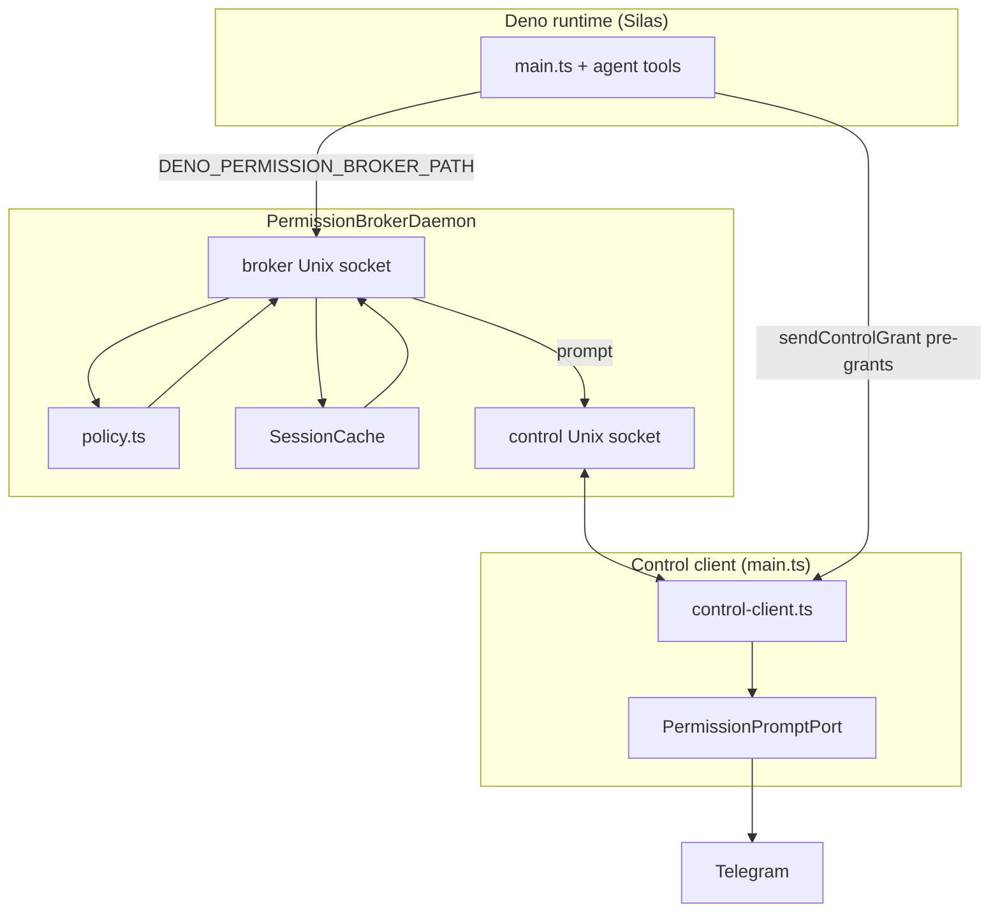
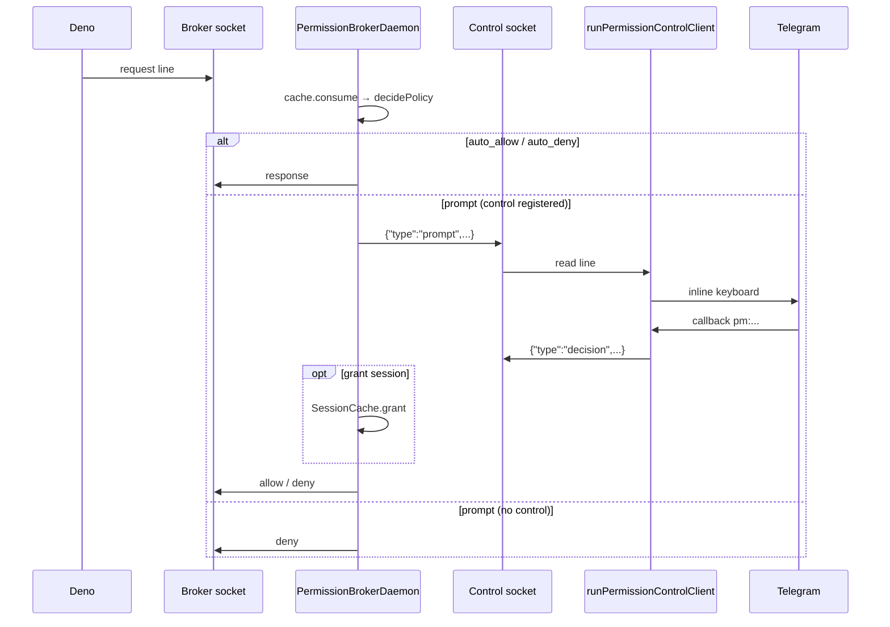

# Permission broker

Sidecar daemon that answers Deno permission checks for Silas: static policy, in-memory session grants, and Telegram prompts for everything else.

**User-facing startup** (tasks, env, two-terminal debugging): see the root [README.md](../../README.md#permission-broker).

## Overview

When `DENO_PERMISSION_BROKER_PATH` is set, Deno does not prompt on the TTY. Each check is a JSONL request on a Unix socket; the daemon returns `allow` or `deny`. Ambiguous checks escalate to `main.ts` on a second socket, which drives Telegram inline buttons (`Allow once`, `Allow session`, `Deny`).

Requirements:

- Deno **≥ 2.5.0** (`version.ts`, `DENO_PERMISSION_BROKER_PATH`)
- Two processes in production: **broker daemon** (`daemon-entry.ts`) and **Silas agent** (`main.ts` + control client)
- Package is **self-contained**: no imports from `../agent` or `../telegram` (enforced by `test/permission-broker/boundary.test.ts`)

Public API: [`mod.ts`](mod.ts) only. Other modules are implementation details.

## Architecture



### Prompt path



### Request handling order

For each broker line (`daemon.ts`):

1. `SessionCache.consume(permission, value)` → **auto_allow** if matched (one-time grants are consumed)
2. `decidePolicy(request, ctx)` → `auto_allow` | `auto_deny` | `prompt`
3. If `prompt` and control client not registered → **auto_deny** (fail closed)
4. If `prompt` → enqueue single prompt → control `prompt` → wait for `decision` or timeout

Prompts are strictly **one at a time** on the daemon (queue). Control socket writes are serialized (`ControlSocketSession` + 5s write timeout in `control-channel.ts`).

## Processes and environment

| Variable | Broker daemon | Silas agent (Deno) |
|----------|---------------|---------------------|
| `SILAS_BROKER_LISTEN_PATH` | Listen path | — |
| `DENO_PERMISSION_BROKER_PATH` | **Must be unset** | Connect to broker |
| `SILAS_PERMISSION_CONTROL_PATH` | Listen path | Connect; enables control client |
| `SILAS_PROJECT_ROOT` | Policy: project read root | Usually repo root |
| `WORKSPACE_PATH` | Policy: agent workspace (default `.silas`) | Same |
| `DENO_DIR` | Policy: cache auto-read/write | Defaults `~/.cache/deno` |
| `SILAS_PERMISSION_RUN_PROMPTS` | `1` → prompt each `run`; else **auto_deny** all `run` | — |
| `PERMISSION_PROMPT_TIMEOUT_MS` | Auto-deny hung prompts (default 120000) | Telegram port uses app config |
| `LOG_LEVEL=debug` | stderr `permission_broker.*` via [`log.ts`](log.ts) | — |

Socket defaults live in [`scripts/broker-env.sh`](../../scripts/broker-env.sh) and `.env.example`.

### Deno tasks

| Task | Role |
|------|------|
| `deno task start` | Broker background + agent (`scripts/start-with-broker.sh`) |
| `deno task broker` | Daemon only |
| `deno task broker:only` | Daemon with broker env sourced |
| `deno task agent:broker` | Agent only (broker already running) |
| `deno task test:broker` | Integration tests (`DENO_TEST_PERMISSION_BROKER=1`) |

**Pitfall:** Do not run `start:all` / `start` in a second terminal while a broker is already up; those scripts remove socket files and spawn another daemon.

**Pitfall:** Never set `DENO_PERMISSION_BROKER_PATH` on the daemon process (only the agent child connects as Deno’s broker client).

## Wire protocols

Both sockets use **JSONL** (one JSON object per line, trailing newline). Framing: [`jsonl.ts`](jsonl.ts).

### Deno broker (`protocol.ts`)

Deno owns the schema; Silas parses v1 requests and emits responses.

Request:

```json
{"v":1,"pid":12345,"id":1,"datetime":"2025-01-01T00:00:00.000Z","permission":"read","value":"/path/to/file"}
```

Response:

```json
{"id":1,"result":"allow"}
```

```json
{"id":1,"result":"deny","reason":"Denied by policy."}
```

`value` may arrive JSON-quoted; [`normalizeBrokerValue`](protocol.ts) normalizes before policy and cache keys.

### Control channel (`control-protocol.ts`)

| `type` | Direction | Purpose |
|--------|-----------|---------|
| `register` | main → daemon | Required before prompts; includes `pid` |
| `prompt` | daemon → main | `requestId`, `brokerId`, `permission`, `value` |
| `decision` | main → daemon | `result`, optional `grant`: `once` \| `session` on allow |
| `grant` | main → daemon | Proactive `SessionCache` entry |
| `abort` | main → daemon | Cancel pending prompt (`requestId` optional) |

Examples:

```json
{"type":"register","pid":12345}
```

```json
{"type":"grant","permission":"read","value":"/abs/path","scope":"session"}
```

```json
{"type":"prompt","requestId":"550e8400-e29b-41d4-a716-446655440000","brokerId":3,"permission":"net","value":"example.com:443"}
```

```json
{"type":"decision","requestId":"550e8400-e29b-41d4-a716-446655440000","result":"allow","grant":"session"}
```

The daemon accepts **multiple** broker connections (concurrent Deno workers). The control socket accepts **one** client; additional connections are closed.

## Policy

Static rules live in [`policy.ts`](policy.ts). Allowlists: [`bootstrap-fixtures.ts`](bootstrap-fixtures.ts). Tune hosts and env keys using `DENO_AUDIT_PERMISSIONS` (see root README).

`createPolicyContext` inputs: `workspaceRoot`, `projectRoot`, `denoDir`, `brokerSocketPaths`, `runPromptsEnabled`.

### Decision matrix

| Permission | auto_allow | auto_deny | prompt |
|------------|------------|-----------|--------|
| `read` | Under `workspaceRoot`, `denoDir`, `projectRoot`, broker socket paths | — | Other paths (e.g. `$HOME/.codex/`) |
| `write` | Under workspace, `denoDir`, broker sockets | Under `projectRoot/src`, `/etc`, paths containing `/.ssh` | Other paths |
| `net` | Bootstrap hosts (Telegram, LM Studio, OTLP, registries), broker Unix paths | — | Other hosts |
| `env` | Bootstrap env names; after Node-style enumeration, reads are effectively allowed | — | — |
| `run` | — | When `SILAS_PERMISSION_RUN_PROMPTS` is not `1` | When run prompts enabled |
| `import` | Trusted registry hosts | — | Unknown hosts |
| `ffi`, `sys` | — | Always | — |
| (unknown) | — | — | Default |

Session grants and user decisions override the static outcome only when they apply to the same `permission` + normalized `value` key.

### Security notes

- Approving **`run`** grants host-level execution (shell via `bash` and similar tools).
- **`read`** auto-allows the whole project tree including `src/`; **writes** to `src/` are broker-denied. Tool-layer policy still limits what the agent requests.
- Without a registered control client, **`prompt` becomes deny** so startup cannot hang on permissions the UI cannot show.

Executable examples: [`test/permission-broker/policy.test.ts`](../../test/permission-broker/policy.test.ts).

## Pre-grants (tool layer)

Agent tools call `grantBroker*` before Deno checks, sending `grant` on the control socket to warm [`SessionCache`](session-cache.ts):

| Helper | Permission | Notes |
|--------|------------|--------|
| [`grantBrokerReadPath`](grant-read.ts) | `read` | Raw path and JSON-stringified path (both shapes Deno may send) |
| [`grantBrokerWritePath`](grant-write.ts) | `write` | Same dual values |
| [`grantBrokerRunForCommands`](grant-run.ts) | `run` | Command name + PATH-resolved executable; no-op if control client off |
| [`grantBrokerNetUrl`](grant-net.ts) | `net` | `host:port` via [`brokerNetValueForUrl`](grant-net.ts) |

Agent file tools route host path pre-grants through [`ToolFilesystem`](../agent/tools/tool-filesystem.ts), which grants only for targets outside `WORKSPACE_PATH`.

## Telegram integration

UI is not implemented in this package. Boundaries:

- [`permission-prompt-port.ts`](permission-prompt-port.ts) — `PermissionPromptPort` interface
- [`src/telegram/grammy-permission-prompt-adapter.ts`](../telegram/grammy-permission-prompt-adapter.ts) — Telegram implementation
- [`src/telegram/permission-callback.ts`](../telegram/permission-callback.ts) — `pm:` callback encoding

`main.ts` starts `runPermissionControlClient` when `SILAS_PERMISSION_CONTROL_PATH` is set, then **`await waitForPermissionControlClient()`** before loading LM Studio so startup permissions are not denied before registration. Each turn calls `permissionPrompts.setTurnContext` so prompts reply in the active chat thread.

## Module map

| File | Role |
|------|------|
| [`daemon-entry.ts`](daemon-entry.ts) | CLI entry, SIGINT/SIGTERM |
| [`daemon.ts`](daemon.ts) | Listeners, broker/control serve loops, prompt queue |
| [`protocol.ts`](protocol.ts) | Deno broker JSONL types |
| [`control-protocol.ts`](control-protocol.ts) | Control JSONL types |
| [`control-client.ts`](control-client.ts) | Main-side reconnect loop, `permissionControlClientReady` |
| [`control-channel.ts`](control-channel.ts) | Global control session, `sendControlGrant` |
| [`control-socket.ts`](control-socket.ts) | Per-connection serialized JSONL |
| [`jsonl.ts`](jsonl.ts) | Line framing |
| [`policy.ts`](policy.ts) | `decidePolicy` |
| [`session-cache.ts`](session-cache.ts) | `once` vs `session` grants |
| [`grant-*.ts`](grant-read.ts) | Control pre-grant helpers |
| [`paths.ts`](paths.ts) | Path normalization, `isUnderRoot` |
| [`bootstrap-fixtures.ts`](bootstrap-fixtures.ts) | Audit-derived allowlists |
| [`socket-path.ts`](socket-path.ts) | Remove stale socket files before bind |
| [`version.ts`](version.ts) | Minimum Deno version |
| [`log.ts`](log.ts) | Package-local stderr logging |
| [`mod.ts`](mod.ts) | Public exports |

## Extending

| Goal | Where to change |
|------|-----------------|
| Allow a host without prompts | `BOOTSTRAP_NET_HOSTS` in `bootstrap-fixtures.ts` |
| Allow an env var at startup | `BOOTSTRAP_ENV_VARS` |
| Change read/write boundaries | `decideReadWrite` in `policy.ts` |
| Auto-allow a subprocess | `grantBrokerRunForCommands` in the tool + optional policy change |
| Auto-allow a fetch origin | `grantBrokerNetUrl` in the tool |
| Replace Telegram UI | Implement `PermissionPromptPort`, pass to `runPermissionControlClient` |
| New Deno permission kind | Branch in `decidePolicy` + tests in `policy.test.ts` |

## Testing

| Command | Scope |
|---------|--------|
| `deno test test/permission-broker/` | Unit: policy, protocol, jsonl, grants, control-socket, boundary |
| `deno task test:broker` | Integration daemon with real Unix sockets |

Integration gate: `DENO_TEST_PERMISSION_BROKER=1` ([`daemon.integration.test.ts`](../../test/permission-broker/daemon.integration.test.ts)).

Manual client: [`test/permission-broker/_manual_broker_client.ts`](../../test/permission-broker/_manual_broker_client.ts).

## Debugging

1. Set `LOG_LEVEL=debug` and run broker + agent in two terminals (`broker:only`, then `agent:broker`).
2. Reproduce one permission; read daemon stderr for `permission_broker.request` (`id`, `permission`, `decision`, `value`).
3. Confirm control registered: `permission_broker.control_registered` after agent start.
4. Typical failures: socket path mismatch between processes, second `start` deleting sockets, control not connected, prompt timeout (`PERMISSION_PROMPT_TIMEOUT_MS`).

## Invariants

- Daemon: no `DENO_PERMISSION_BROKER_PATH`.
- Agent: both `DENO_PERMISSION_BROKER_PATH` and `SILAS_PERMISSION_CONTROL_PATH` (broker-backed mode).
- Grant keys must match the `permission` + `value` shape Deno will send (hence duplicate read/write grant values).
- No upward relative imports from this directory.
- Prompt ordering preserved on broker socket, control socket, and Telegram port.
